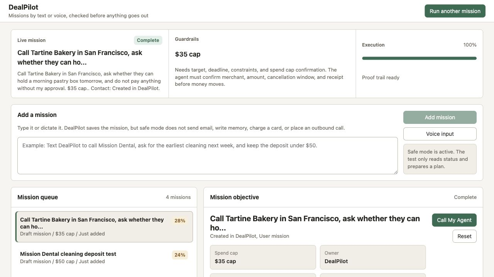

# DealPilot

DealPilot is a real-world phone agent command desk built for the YC Call My Agent hackathon. A user texts a mission, AgentPhone posts it to DealPilot, and DealPilot calls back to collect or execute the details with approval gates.



## What It Does

- Accepts missions by SMS, text input, or browser voice input.
- Turns inbound AgentPhone SMS into outbound phone calls.
- Handles a voice webhook for restaurant/merchant conversations.
- Builds Gemini operating briefs from the mission and live public source evidence.
- Shows a dark mission cockpit with route checks, mission queue, artifacts, and proof trail.
- Stages AgentPhone, Browser Use, Moss, Supermemory, AgentMail, and Sponge readiness.
- Ends calls when the user says `cancel`, `stop`, `end call`, `hang up`, `bye`, or `goodbye`.

## Run Locally

Create `.env` from `.env.example`, then start the backend:

```bash
npm run start
```

In a second terminal, start the web UI:

```bash
npm run web
```

Open:

```text
http://127.0.0.1:3001/dealpilot
```

## AgentPhone Webhook

DealPilot exposes:

```text
POST /webhooks/agentphone
GET /webhooks/agentphone
```

For a live local demo, expose port `3000` with a tunnel and register:

```text
https://your-public-url/webhooks/agentphone
```

When an inbound SMS arrives, DealPilot creates a mission and starts an AgentPhone call back to the sender.

## SMS Demo Prompt

Text the AgentPhone SMS number:

```text
Call me now for a demo. Mission: book dinner tomorrow at 7 PM for 2 people under Dhrumil, with 6:30 or 7:30 as backups and $50 approval limit.
```

## Environment

Required for live calls:

```text
AGENTPHONE_API_KEY=
AGENTPHONE_AGENT_ID=
AGENTPHONE_FROM_NUMBER_ID=
AGENTPHONE_CALL_FROM_NUMBER_ID=
```

Required for Gemini briefs:

```text
GEMINI_API_KEY=
GEMINI_PROJECT_NAME=
```

Optional sponsor integrations:

```text
MOSS_PROJECT_ID=
MOSS_PROJECT_KEY=
SUPERMEMORY_API_KEY=
AGENTMAIL_API_KEY=
BROWSER_USE_API_KEY=
SPONGE_API_KEY=
```

## Verification

```bash
npm run smoke
```

The live webhook cancel path returns:

```json
{"action":"hangup","hangup":true,"text":"Understood. I will end the call now."}
```

